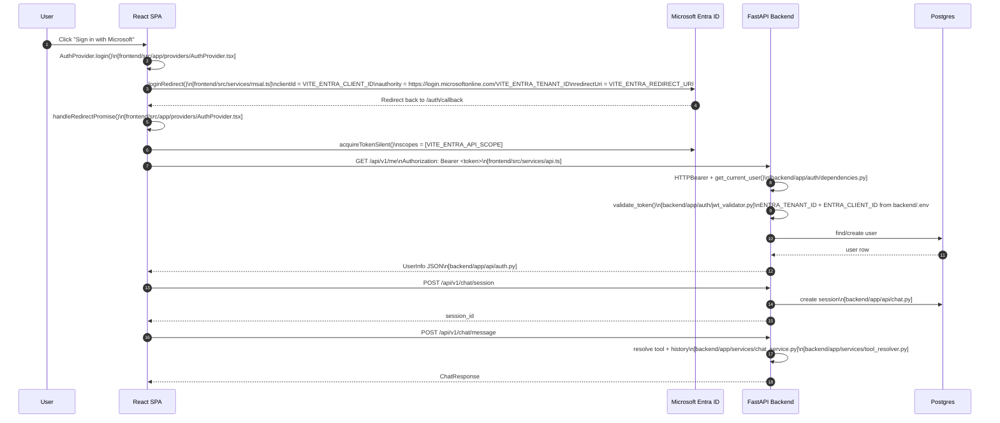

# Azure AI Ops Auth Flow

## Sequence

## Env Vars

### Frontend

- `VITE_MOCK_AUTH=false`
- `VITE_ENTRA_CLIENT_ID`
  - Frontend SPA app registration client ID
- `VITE_ENTRA_TENANT_ID`
  - Entra tenant / directory ID
- `VITE_ENTRA_API_SCOPE`
  - Backend API scope, for example `api://<backend-client-id>/access_as_user`
- `VITE_ENTRA_REDIRECT_URI`
  - Usually `http://localhost:5173/auth/callback`
- `VITE_ENTRA_SCOPES`
  - Optional extra scopes

### Backend

- `ENTRA_TENANT_ID`
  - Same tenant / directory ID
- `ENTRA_CLIENT_ID`
  - Backend API app registration client ID
- `DEV_BYPASS_AUTH=true`
  - Local development only

## File Map

### Frontend

- [frontend/src/services/msal.ts](frontend/src/services/msal.ts)
- [frontend/src/app/providers/AuthProvider.tsx](frontend/src/app/providers/AuthProvider.tsx)
- [frontend/src/features/auth/LoginPage.tsx](frontend/src/features/auth/LoginPage.tsx)
- [frontend/src/features/auth/AuthCallbackPage.tsx](frontend/src/features/auth/AuthCallbackPage.tsx)
- [frontend/src/services/api.ts](frontend/src/services/api.ts)
- [frontend/src/services/authStorage.ts](frontend/src/services/authStorage.ts)

### Backend

- [backend/app/auth/dependencies.py](backend/app/auth/dependencies.py)
- [backend/app/auth/jwt_validator.py](backend/app/auth/jwt_validator.py)
- [backend/app/api/auth.py](backend/app/api/auth.py)
- [backend/app/api/chat.py](backend/app/api/chat.py)
- [backend/app/api/approvals.py](backend/app/api/approvals.py)
- [backend/app/services/chat_service.py](backend/app/services/chat_service.py)
- [backend/app/services/tool_resolver.py](backend/app/services/tool_resolver.py)

## Short Explanation

1. User clicks sign in on the frontend.
2. React uses the frontend app registration to start Microsoft login.
3. Entra redirects back to the frontend callback route.
4. React requests a token for the backend API scope.
5. React sends the token to FastAPI.
6. FastAPI validates the token using the backend app registration and tenant.
7. If valid, the backend creates/loads the user and serves chat/session/approval data.

