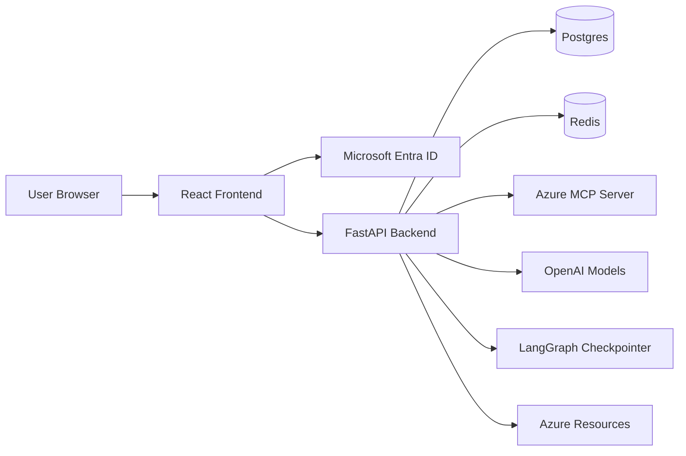
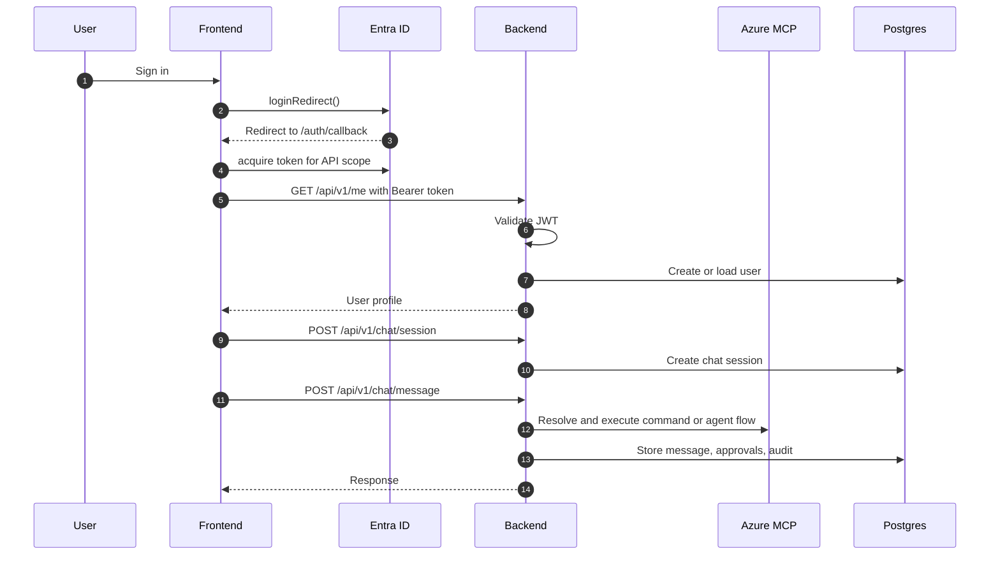

# Azure AI Ops Railway Deployment

Azure AI Ops is a full-stack operations assistant for Azure that combines a React SPA, a FastAPI backend, Microsoft Entra authentication, Azure MCP tooling, Postgres persistence, Redis support, and LangGraph-based agent execution.

## Business Use Case

The product is designed for teams that need a controlled, auditable way to work with Azure resources through a chat interface.

- Reduce the friction of navigating Azure portals for routine operations.
- Centralize chat, approvals, and audit history in one workflow.
- Support both technical users and admins with a guided interface.
- Enforce approval gates for risky or destructive actions.
- Keep a durable record of sessions, approvals, and execution history.

Typical usage:

- A user signs in with Microsoft Entra ID.
- The user opens a new chat session.
- The backend resolves the user request into an Azure MCP command.
- Read-only questions are answered by the agent.
- Mutating actions can trigger approval before execution.
- Admins review, approve, reject, and track action history.

## High Level Design

### Main responsibilities

- Frontend handles login, chat UI, approvals UI, and API calls.
- Backend validates JWTs, manages sessions, stores conversation history, and orchestrates tool calls.
- Azure MCP provides tool discovery and command execution against Azure.
- Postgres stores durable business data.
- Redis is available for shared ephemeral state, caching, or rate limiting.
- LangGraph stores agent state and session memory.

## Low Level Design

### Frontend

- React 19 with Vite.
- Microsoft authentication is implemented in `frontend/src/services/msal.ts`.
- Auth state is managed in `frontend/src/app/providers/AuthProvider.tsx`.
- API calls go through `frontend/src/services/api.ts`.
- Chat, approvals, and auth pages are split into feature folders under `frontend/src/features/`.

### Backend

- FastAPI app entry point is `backend/app/main.py`.
- JWT validation is in `backend/app/auth/jwt_validator.py`.
- User/session/chat APIs are in `backend/app/api/`.
- Business logic sits in `backend/app/services/`.
- Azure MCP integration is in `backend/app/mcp/client.py`.
- MCP command learning and cataloging are in `backend/app/services/mcp_command_registry.py` and `backend/app/services/tool_catalog_service.py`.
- Tool planning and command selection are in `backend/app/services/tool_resolver.py`.
- LangGraph checkpointing is initialized from `backend/app/startup/checkpoint_init.py`.

### Request Flow

## Core Architecture Decisions

- Separate frontend and backend services for independent deployment.
- OAuth-style sign-in with Microsoft Entra ID.
- Explicit API token validation on the backend.
- Approval-first handling for sensitive actions.
- Database-backed persistence for sessions, messages, approvals, and audit logs.
- MCP tool discovery at backend startup to keep tool metadata current.
- LangGraph used for agent memory and execution flow.

## Repository Layout

- `backend/` contains FastAPI, services, auth, MCP, LangGraph, and DB models.
- `frontend/` contains the React app, UI, auth flow, and API client.
- `tools/` contains utility scripts.
- `docker-compose.yml` supports local development only.
- `RAILWAY_DEPLOYMENT.md` contains a concise Railway checklist.
- `AUTH_FLOW.md` documents the Entra login flow.

## Railway Deployment Criteria

Use separate Railway services for backend and frontend.

### Backend readiness checklist

- `ENVIRONMENT=production`
- `OPENAI_API_KEY` is set
- `DATABASE_URL` points to Railway Postgres
- `REDIS_URL` points to Railway Redis
- `ENTRA_TENANT_ID` is set
- `ENTRA_CLIENT_ID` is set
- `AZURE_TENANT_ID` is set
- `AZURE_CLIENT_ID` is set
- `AZURE_CLIENT_SECRET` is set
- `AZURE_SUBSCRIPTION_ID` is set
- `CORS_ORIGINS` includes the frontend public URL
- The backend service root directory is `backend`
- The backend deployment passes `/api/v1/health`

### Frontend readiness checklist

- `VITE_API_BASE_URL` points to the backend public URL plus `/api/v1`
- `VITE_MOCK_AUTH=false`
- `VITE_ENTRA_CLIENT_ID` is set
- `VITE_ENTRA_TENANT_ID` is set
- `VITE_ENTRA_REDIRECT_URI` matches the deployed frontend callback URL
- `VITE_ENTRA_API_SCOPE` is set
- The frontend service root directory is `frontend`
- The frontend deployment serves the SPA successfully from the Railway public URL

### Database and infrastructure checklist

- Railway Postgres service is created and reachable by backend.
- Railway Redis service is created and reachable by backend.
- Backend uses private/internal Railway connection variables.
- Public URLs are used only for browser access, not for internal database traffic.

### Identity and Azure checklist

- Frontend redirect URI is registered in Microsoft Entra.
- Backend API scope is exposed and consented.
- Azure service principal has at least Reader access to the subscription for discovery.
- Azure permissions are granted for the right client ID, not the frontend app registration by mistake.

## Best Practices

- Keep `.env` files local and out of git.
- Treat `VITE_...` variables as build-time frontend inputs, not runtime secrets.
- Treat backend env vars as deployment secrets.
- Use the private Postgres and Redis URLs for backend connectivity inside Railway.
- Use exact redirect URIs in Entra, including scheme, host, and path.
- Prefer least privilege for Azure RBAC. Reader is enough for discovery, Contributor only when needed.
- Review command catalogs and Azure MCP tool output when troubleshooting model-driven command selection.
- Use deployment logs for runtime issues and build logs for image creation issues.
- Avoid hardcoded local connection strings in production code.
- Keep approval-gated actions explicit and auditable.

## Known Operational Gotchas

- A missing Entra redirect URI causes `AADSTS500113`.
- Missing Azure RBAC on the subscription causes `AuthorizationFailed` for subscription/resource listing.
- Incorrect Railway root directory causes build detection failures.
- A frontend container can start successfully while the public URL still fails if routing or domains are misconfigured.
- The backend must be able to validate JWTs and reach Azure services before chat can fully work.
- The tool planner can fail if the Azure MCP registry differs from expectations or if the model returns an invalid command.

## Useful Endpoints

- `GET /api/v1/health`
- `GET /api/v1/me`
- `POST /api/v1/chat/session`
- `POST /api/v1/chat/message`
- `GET /api/v1/chat/history/{session_id}`
- `GET /api/v1/debug/tools`
- `GET /api/v1/debug/registry`
- `GET /api/v1/speech/token`

## Local Development

- Backend Dockerfile: `backend/Dockerfile`
- Frontend Dockerfile: `frontend/Dockerfile`
- Local compose file: `docker-compose.yml`

The backend expects runtime env vars from `.env`.
The frontend expects Vite build vars from `.env`.

## Reference Docs

- [Railway deployment notes](./RAILWAY_DEPLOYMENT.md)
- [Auth flow notes](./AUTH_FLOW.md)
- [Backend entry point](./backend/app/main.py)
- [Backend settings](./backend/app/config/settings.py)
- [Frontend auth provider](./frontend/src/app/providers/AuthProvider.tsx)
- [Frontend MSAL config](./frontend/src/services/msal.ts)

## Suggested Next Improvements

- Add a small health endpoint for MCP readiness.
- Add a startup sanity check that prints the active Azure/MCP environment summary.
- Cache stable MCP catalogs when the tool set is large.
- Add automated smoke tests for auth, chat session creation, and approvals.
- Add a documented production checklist for Entra, RBAC, Railway, and DB migrations.
